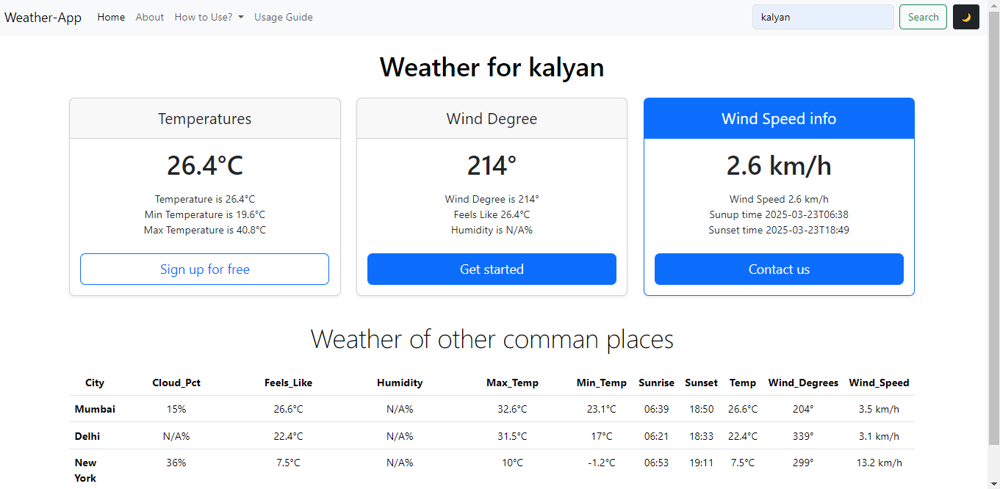
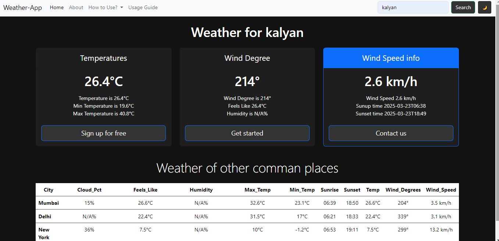

# 🌦️ Weather App
A **Real-Time Weather Application** that provides weather updates by city name. It shows temperature, humidity, wind speed, and weather conditions. Users can search for any city and view live weather data. It also displays weather information for popular cities. A dark mode toggle enhances user experience. The app updates data in real time for accurate information. 
## 📌 Features

- 🌍 **Real-Time Weather Data**: Fetches live weather details using the Open-Meteo API.
- 🔍 **Search by City**: Users can enter a city name to get weather updates.
- 🏙️ **Common Cities Weather**: Displays weather for popular cities (Mumbai, Delhi, New York, London).
- 🌑 **Dark Mode**: Users can toggle between light and dark themes, with the preference saved in local storage.
- 📊 **Detailed Weather Information**: Includes temperature, humidity, wind speed, sunrise, sunset, and more.

## 🛠️ Technologies Used

- **Frontend**: HTML, CSS, JavaScript
- **API**: [Open-Meteo API](https://open-meteo.com/)
- **Build Tool**: Vite

## 📂 Project Structure

```
weather-app/
├── index.html
├── main.js
├── style.css
└── package.json
```

## 🚀 Installation and Setup

1. **Clone the Repository**

```bash
git clone https://github.com/vishallokhande8788/weather-app.git
cd weather-app
```

2. **Install Dependencies**

```bash
pnpm install
```

3. **Run the Development Server**

```bash
pnpm run dev
```

4. **Build for Production**

```bash
pnpm run build
```

5. **Preview the Build**

```bash
pnpm run preview
```

## 📋 How It Works

1. On page load:
   - Default weather for "Delhi" is fetched.
   - Weather for common cities is displayed.
2. Users can enter a city name and click the **Submit** button to fetch weather details.
3. **Dark Mode**: Users can toggle dark mode using the **Dark Mode** button. The preference is saved in `localStorage`.

## 📊 Weather Details Displayed

- Current Temperature
- Feels Like Temperature
- Minimum and Maximum Temperature
- Humidity
- Wind Speed and Direction
- Sunrise and Sunset Time
- Cloud Coverage

## 🌑 Dark Mode

- Dark mode can be toggled using the **Dark Mode** button.
- The preference is stored in `localStorage` to persist across sessions.

## 📌 Example API Calls

1. **Geocoding API** (to get latitude and longitude):

```
GET https://geocoding-api.open-meteo.com/v1/search?name=Delhi&count=1&language=en&format=json
```

2. **Weather Forecast API** (to get weather details):

```
GET https://api.open-meteo.com/v1/forecast?latitude=28.61&longitude=77.23&current_weather=true&daily=temperature_2m_min,temperature_2m_max,sunrise,sunset,cloud_cover_mean&timezone=auto
```

## 📸 Screenshots

1. **Light Mode**  
   
   

2. **Dark Mode**  
   
   


## 🤝 Contributing

Contributions are welcome! Feel free to fork the repository and open a pull request.

1. Fork the project
2. Create a new branch: `git checkout -b feature/your-feature`
3. Commit your changes: `git commit -m 'Add some feature'`
4. Push to the branch: `git push origin feature/your-feature`
5. Open a Pull Request

## 📄 License

This project is licensed under the MIT License.

---

Made with  by [Vishal Lokhande]

